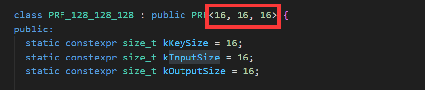

# C++ Templates
C++中函数和类均有template（模板）的概念，模板可以帮助我们自定义类型，尤其是当我们希望用一个函数处理多种数据类型时：

一个简单的函数模板示例：

```C++
template <typename AnyType>
//前面的typename是已经存在的type，后面的AnyType是我们自己自定义的名字
void Swap(AnyType &a, AnyType &b){
    AnyType c = a;
    a = b;
    b = c;
}
```


在上面这个示例中，当我们需要什么type时，只需要将`typename`修改为什么类型，不需要全局修改（可以减少工作量和错误）。

进一步的，typename本身就可以接受所有类型，如下面例子所示：

```C++
#include<iostream>
#include<string>
template <typename anything>
void swap(anything &a, anything &b){
    anything c;
    c=a;
    a=b;
    b=c;
}
int main(){
    int a=2;
    int b=4;
    std::cout<<"a,b=("<<a<<","<<b<<")"<<std::endl;
    swap(a,b);
    std::cout<<"a,b=("<<a<<","<<b<<")"<<std::endl;   
    std::string c="jsdoifjoi";
    std::string d="sfwewee";
    std::cout<<"c,d=("<<c<<","<<d<<")"<<std::endl;
    swap(c,d);
    std::cout<<"c,d=("<<c<<","<<d<<")"<<std::endl;  
    return 0;
}
\**输出结果
a,b=(2,4)
a,b=(4,2)
c,d=(jsdoifjoi,sfwewee)
c,d=(sfwewee,jsdoifjoi)
**\
```


### 局限性

对于一些操作，可能会出错，比如“>"的时候，输入的是两个字符串。

可以考虑使用explicit specialization操作（显式模板特化）即对某些特殊类型的进行特化处理（比如结构体，字符串等...)

#### 模板特例化

如下面示例：针对某些特定类型进行特例化

```C++
template <typename T>
void swap(T &a, T &b){
    T c;
    c=a;
    a=b;
    b=c;
}

struct job{
    std::array<char, 40> name;
    double salary;
    int floor;
};

template <> void swap<job>(job &j1,job &j2){
    double t1=0;
    t1=j1.salary;
    j1.salary=j2.salary;
    j2.salary=t1;
    int t2=0;
    t2=j1.floor;
    j1.floor=j2.floor;
    j2.floor=t2;

}

```


并且需要注意到是，通常模板函数都会放在头文件中声明和定义，不然会报错，因为模板函数的实例化在编译时就需要完成（在推导出函数后，需要生成相应类型的函数，替换模板参数，生成一个新函数）。

所以：只在头文件中声明是不够，函数的定义也要在头文件中进行。虽然有比如显式实例化的方法，但只适用于已知的类型集合。如果需要在不同的源文件中使用不同的类型实例化模板函数，那么需要针对每个类型进行显式实例化。这可能会导致代码冗余和可维护性问题。

#### 模板实例化

告知编译器应该实际上参数是什么样子的

### 类中的模板

与函数想象，我们以最近看的密码封装代码进行阅读学习。


下面首先定义了一个PRF类，其中的KeySize ， InputSize， OutputSize都是size_t类型

```C++
template <size_t KeySize, size_t InputSize, size_t OutputSize>
class PRF { // NOLINT
public:
  virtual ~PRF() = default;

  virtual void eval_b2b(gsl::span<const uint8_t> input,
                        gsl::span<uint8_t> output) = 0;
  virtual std::array<uint8_t, OutputSize> eval(gsl::span<const uint8_t> input) {
    std::array<uint8_t, OutputSize> output{};
    eval_b2b(input, output);
    return output;
  }
};
```


我们可以在派生类时实例化该类：

```C++
class PRF_128_128_128 : public PRF<16, 16, 16> {
public:
  static constexpr size_t kKeySize = 16;
  static constexpr size_t kInputSize = 16;
  static constexpr size_t kOutputSize = 16;

  PRF_128_128_128() = delete;
  PRF_128_128_128(const PRF_128_128_128 &) = delete;
  PRF_128_128_128 &operator=(const PRF_128_128_128 &) = delete;
  PRF_128_128_128(PRF_128_128_128 &&) = default;
  PRF_128_128_128 &operator=(PRF_128_128_128 &&) = default;
  ~PRF_128_128_128() override = default;

  explicit PRF_128_128_128(gsl::span<const uint8_t> key);

  void eval_b2b(gsl::span<const uint8_t> input,
                gsl::span<uint8_t> output) override;

private:
  using EVP_CIPHER_CTX_free_ptr =
      std::unique_ptr<EVP_CIPHER_CTX, decltype(&::EVP_CIPHER_CTX_free)>;

  EVP_CIPHER_CTX_free_ptr ctx_;

  std::array<uint8_t, kKeySize> key_;
};
```


当前疑问的点：

有点不理解这个<16,16,16>是怎么实例化的：



面的这个模板规定的三个名称都是size_t，为什么到下面实例化的时候可以作为16呢？

理解：

其实是之前的理解有误：认为如果template<size_t keysize>就代表keysize是size_t的一个别名。

而实际上，template<size_t keysize>代表着keysize是从size_t中选取的一个数字。

只有class和typename代表着数据类型。


另一个模板的使用就较为常规（也有一些新的知识）


下面是要打包一系列报错信息：

```C++
template <typename... Args>
std::string format(const std::string &fmt, Args... args) {
  size_t size = snprintf(nullptr, 0, fmt.c_str(), args...) + 1;
  std::string buf;
  snprintf(buf.data(), size, fmt.c_str(), args...);

  return buf;
}
```


这里的typename加了...，typename...的意思是任意类型任意个数的类型，所以Args是一种通用参数表示，任意个任意种参数输出一个字符串。

接收的输入包括一个字符串和一系列参数`const std::string &fmt, Args... args` ，代指可以有很多个参数，第一个参数是一个字符串。

后面的`snprintf`是一个C/C++标准库函数，位于`<cstdio>`（C）或 `<cstdio>`（C++）头文件中。它是一个格式化输出函数，用于将格式化的数据写入指定的字符串缓冲区。（在这里主要是记录长度）

`snprintf`函数的原型如下：

```C++
int snprintf(char* str, size_t size, const char* format, ...);
```


该函数接受多个参数，其中最重要的是`str`、`size`和`format`。

- `str`是一个指向字符数组的指针，用于存储格式化后的字符串。这个字符数组必须具有足够的空间来容纳输出的字符串。

- `size`是字符数组的大小，即缓冲区的最大容量。这个参数用于防止输出超过缓冲区的大小，避免缓冲区溢出。

- `format`是一个格式化字符串，指定输出的格式和要插入到结果字符串中的值。它可以包含普通的字符和格式化占位符，如`%d`、`%f`等。

`snprintf`函数的行为类似于`printf`函数，但它将结果输出到指定的字符串缓冲区中，而不是标准输出流。它返回写入缓冲区的字符数（不包括终止空字符`\0`），或者如果写入失败则返回负值。

这个函数在处理字符串时非常有用，可以方便地将格式化的数据写入字符数组中，而不是直接输出到终端。它常用于构建格式化的输出字符串、日志记录和数据序列化等场景。

之后定义的`buf`变量是函数的输出结果，而`buf.data()`这一用法是 C++ 标准库中的 `std::string` 类的成员函数，用于返回指向底层字符数组的指针。

`std::string` 是 C++ 标准库中提供的用于操作字符串的类。`data()` 函数返回一个指向 `std::string` 存储的字符数组的指针，该字符数组是以空字符 `'\0'` 结尾的。返回的指针可以用于访问字符串的原始字符数据。

以下是 `std::string::data()` 函数的原型：

```C++
const char* data() const noexcept;
```


返回的指针是指向 `const char` 类型的常量指针，因此不能通过该指针修改 `std::string` 对象中的字符内容。如果你想修改字符串，应该使用 `std::string` 的其他成员函数和操作符。

使用 `data()` 函数可以方便地将 `std::string` 对象传递给需要接受字符数组指针的函数或库，或者以 C 风格的字符串形式访问 `std::string` 的内容。但请注意，在使用返回的指针时要确保 `std::string` 对象仍然有效，且没有发生修改或销毁，以避免悬空指针或访问无效内存的问题。


