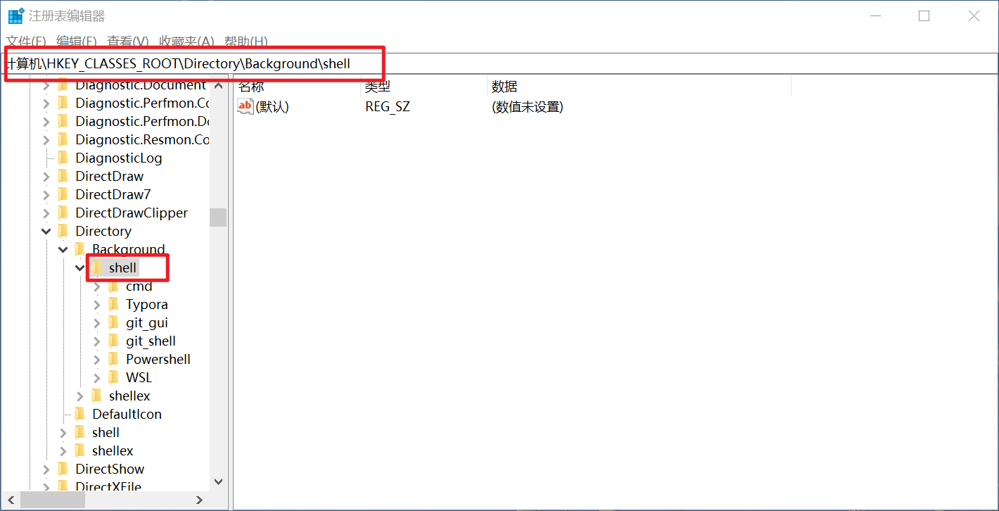
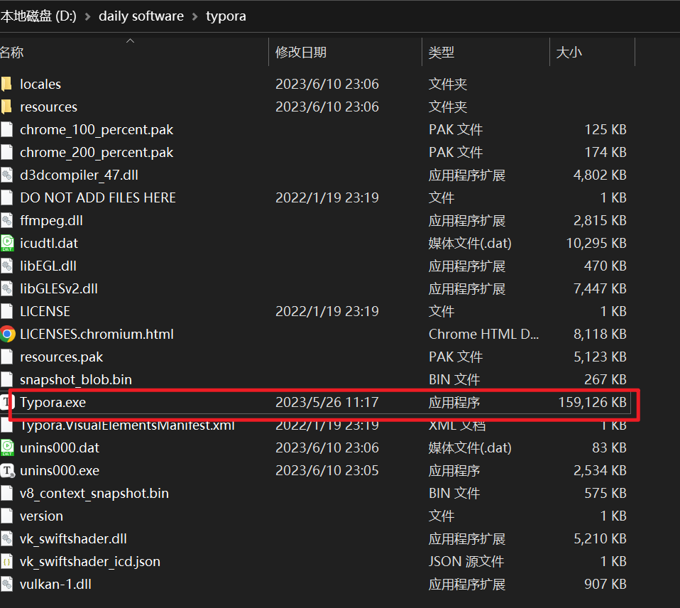
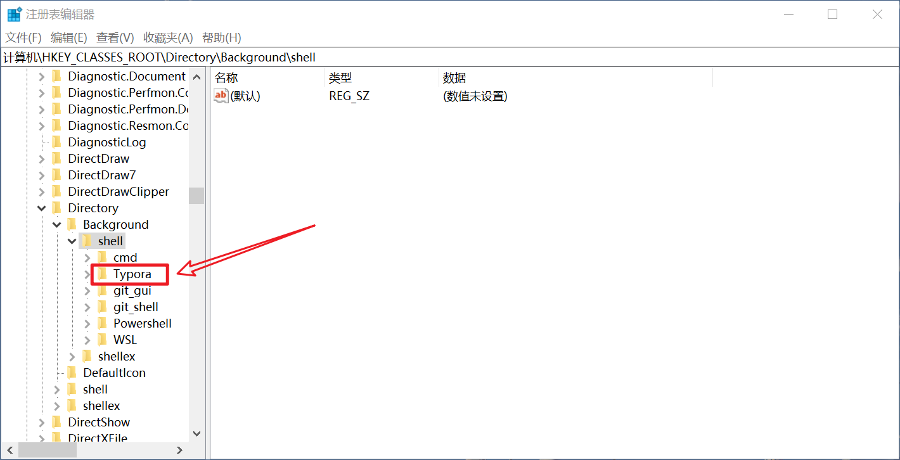
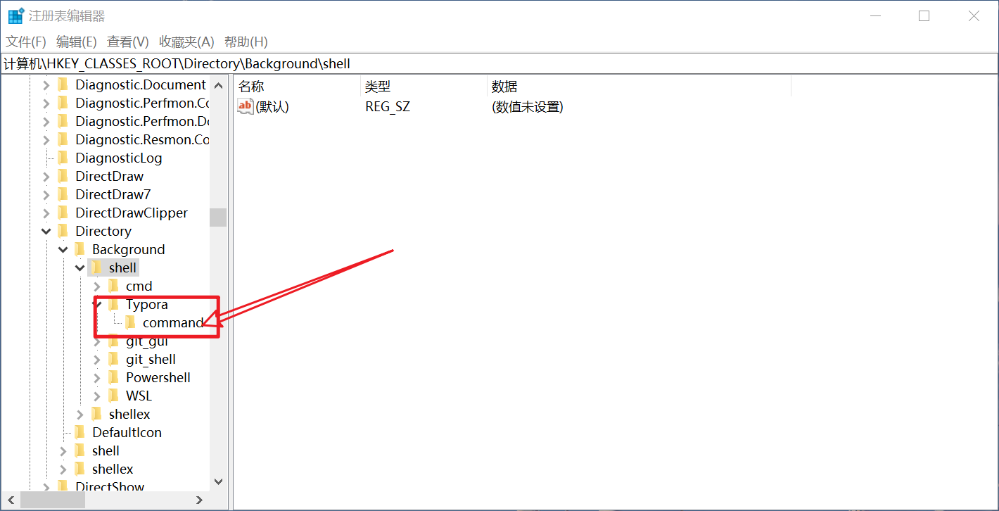
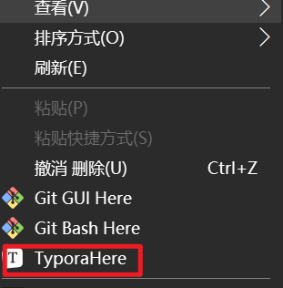
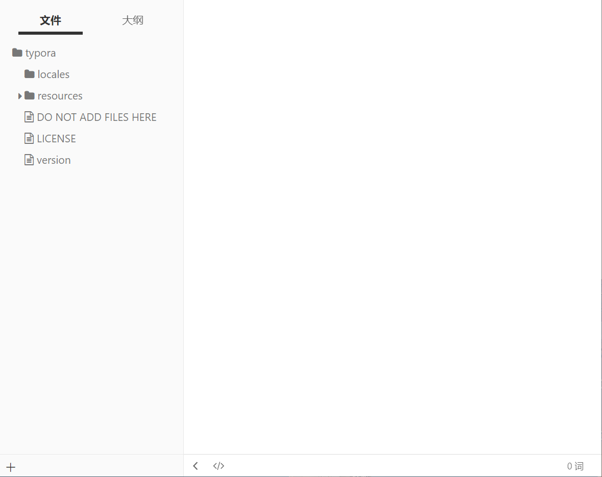

# Window下右键软件设置快捷键

[Back to Short Blogs](../index2.html)

## 1. 打开注册表编辑器

> win+R或直接搜索注册表编辑器

打开路径`计算机\HKEY_CLASSES_ROOT\Directory\Background\shell`，我们之后就要在这个文件夹下加入快捷键，如下图所示：

## 2. 找到你想安装的软件路径

> 在这里我以Typora为例子

我的Typora安装在`D:\daily software\typora`路径下，所以我们需要用到的执行文件是`D:\daily software\typora\Typora.exe`。

## 3. 将软件信息加入注册表

我们建立一个新的文件夹（项或者键，叫法不同）

之后在该文件夹下新建`command`文件夹（项）：

在`Typora`新建两个值，一个`默认`（显示的名字），另一个为`Icon`（图标显示）：

> 默认中的值设置为：`Typo&raHere`
>
> Icon中的值设置为：`D:\daily software\typora\Typora.exe`，即你的软件路径

在`command`的默认字符串值下编辑：

> 值设置为："D:\daily software\typora\Typora.exe" "."
>
> 这句话的意思是在当前路径下运行该软件

## 4. 任意打开一个文件夹测试

右键：

点击即可在当前文件夹下运行：

