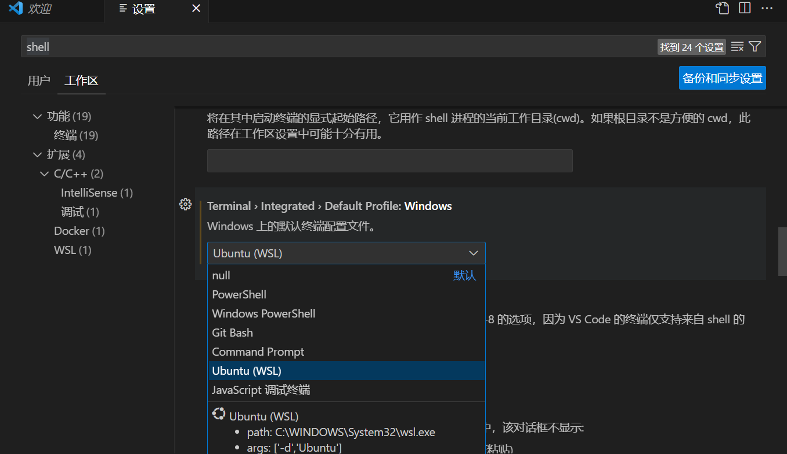
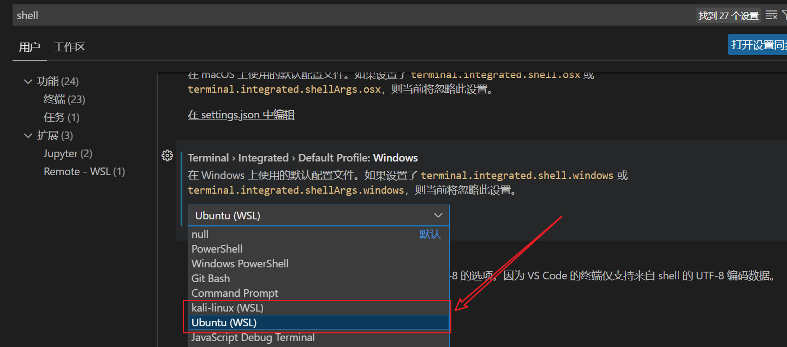

# VScode中如何修改默认终端

[Back to Short Blogs](../index2.html)

在设置中搜索shell，找到下面选项：

> 我这里选择的就是Ubuntu（WSL）作为默认终端



> 除此，Windows 10上安装WSL步骤在此补充：

首先在Windows Store上安装WSL软件（空壳，无系统）。

之后在我们还要在powershell命令行安装对应系统版本：

1.看看网上支持的wsl系统有哪些：

```bash
PS C:\Users\Administrator> wsl --list --online
以下是可安装的有效分发的列表。
使用 'wsl.exe --install <Distro>' 安装。

NAME                                   FRIENDLY NAME
Ubuntu                                 Ubuntu
Debian                                 Debian GNU/Linux
kali-linux                             Kali Linux Rolling
Ubuntu-18.04                           Ubuntu 18.04 LTS
Ubuntu-20.04                           Ubuntu 20.04 LTS
Ubuntu-22.04                           Ubuntu 22.04 LTS
OracleLinux_7_9                        Oracle Linux 7.9
OracleLinux_8_7                        Oracle Linux 8.7
OracleLinux_9_1                        Oracle Linux 9.1
openSUSE-Leap-15.5                     openSUSE Leap 15.5
SUSE-Linux-Enterprise-Server-15-SP4    SUSE Linux Enterprise Server 15 SP4
SUSE-Linux-Enterprise-15-SP5           SUSE Linux Enterprise 15 SP5
openSUSE-Tumbleweed                    openSUSE Tumbleweed
```

2.安装对应版本(比如我这里安装的就是kali-linux版本)

```bash
PS C:\Users\Administrator> wsl --install kali-linux
正在安装: Kali Linux Rolling
已安装 Kali Linux Rolling。
正在启动 Kali Linux Rolling...
Installing, this may take a few minutes...
Please create a default UNIX user account. The username does not need to match your Windows username.
For more information visit: https://aka.ms/wslusers
Enter new UNIX username: xxxxxx
New password:
Retype new password:
passwd: password updated successfully
Installation successful!
┏━(Message from Kali developers)
┃
┃ This is a minimal installation of Kali Linux, you likely
┃ want to install supplementary tools. Learn how:
┃ ⇒ https://www.kali.org/docs/troubleshooting/common-minimum-setup/
┃
┗━(Run: “touch ~/.hushlogin” to hide this message)

```

3.查看系统已经安装了哪些系统及其状态

```bash
PS C:\Users\Administrator> wsl -l -v
  NAME          STATE           VERSION
* Ubuntu        Stopped         2
  kali-linux    Running         2
#这里你也可以输入：wsl --list --verbose
#我们也可以修改默认在powershell中启动的wsl（带*的系统，输入wsl会直接进入）
PS C:\Users\Administrator> wsl --set-default Kali-linux
操作成功完成。

```

4.启动对应wsl

```bash
PS C:\Users\Administrator> wsl
┏━(Message from Kali developers)
┃
┃ This is a minimal installation of Kali Linux, you likely
┃ want to install supplementary tools. Learn how:
┃ ⇒ https://www.kali.org/docs/troubleshooting/common-minimum-setup/
┃
┗━(Run: “touch ~/.hushlogin” to hide this message)
┌──(XXX@XXXXX)-[/mnt/c/Users/Administrator]
└─$ exit
#值得注意在子系统里输入“wsl”是没有相关软件的，输入exit可以退出回到原系统
```

5.销毁某子系统

```bash
PS C:\Users\Administrator> wsl --unregister Kali-linux
正在注销。
操作成功完成。
PS C:\Users\Administrator> wsl --list
适用于 Linux 的 Windows 子系统分发:
Ubuntu (默认)
```

6.进入某特定子系统

```bash
PS C:\Users\Administrator> wsl -d Ubuntu
➜  Administrator exit
PS C:\Users\Administrator>
#采用-d选项即可
```

7.配置vscode中使用哪个子系统

还是在设置的terminal>integrated>default profile中选择即可：




